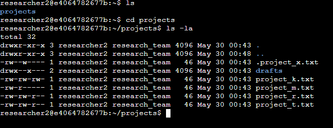
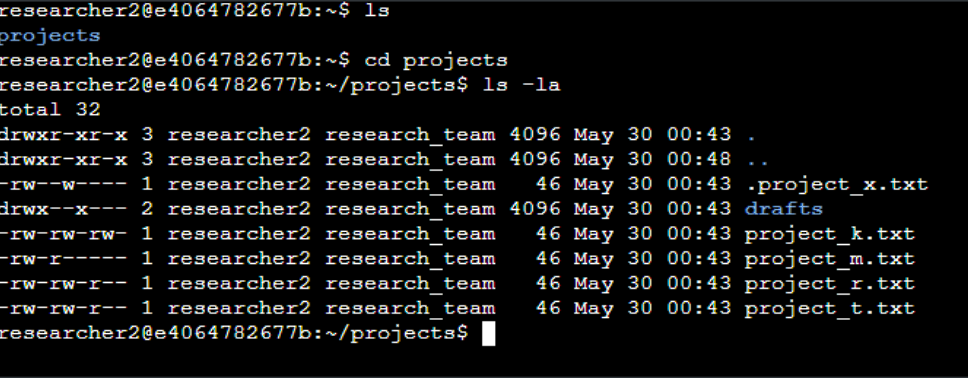
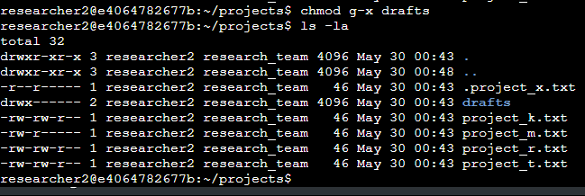
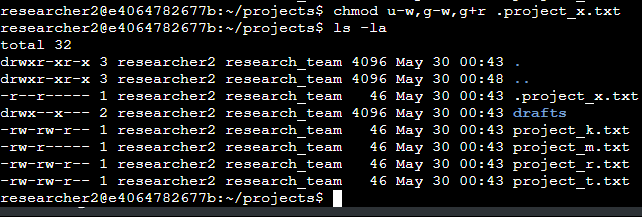
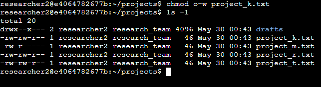

# Linux File Permissions Management Project

## 🔐 Project Overview

This project demonstrates practical implementation of Linux file permission management for a research organization's security requirements. The project focuses on updating file and directory permissions to ensure proper authorization levels and maintain system security.

## 📋 Table of Contents

- [Project Description](#project-description)
- [Technologies Used](#technologies-used)
- [Key Learning Outcomes](#key-learning-outcomes)
- [Implementation Steps](#implementation-steps)
- [Commands Reference](#commands-reference)
- [Project Structure](#project-structure)
- [Screenshots](#screenshots)
- [Security Considerations](#security-considerations)
- [Future Improvements](#future-improvements)

## 📖 Project Description

The research team at our organization required updates to file permissions for files and directories within the projects directory. The existing permissions did not reflect the appropriate authorization levels needed for security compliance. This project involved:

- Analyzing current permission structures
- Implementing security best practices
- Restricting unauthorized access
- Maintaining proper user group permissions

## 🛠️ Technologies Used

- **Operating System**: Linux
- **Shell**: Bash
- **Primary Commands**: `ls`, `chmod`, `cd`
- **Permission Management**: UNIX file permission system

## 🎯 Key Learning Outcomes

- Understanding Linux file permission structure (rwx)
- Implementing the principle of least privilege
- Managing user, group, and other permissions
- Working with hidden files and directories
- Using chmod command with various options

## 🔧 Implementation Steps

### 1. Initial Permission Assessment

Used `ls -la` command to examine current permissions in the projects directory:

```bash
cd projects
ls -la
```

**Key Findings**:
- Multiple users with various access levels
- Hidden file `.project_x.txt` discovered
- Five project files with inconsistent permissions
- Directory permissions requiring updates

### 2. Permission String Analysis

Each file's permission string follows the format: `drwxrwxrwx`

| Position | Description |
|----------|-------------|
| 1st | File type (`d` = directory, `-` = regular file) |
| 2nd-4th | User permissions (read, write, execute) |
| 5th-7th | Group permissions (read, write, execute) |
| 8th-10th | Other permissions (read, write, execute) |

**Example**: `project_t.txt` with permissions `-rw-rw-r--`
- Regular file (not directory)
- User: read + write permissions
- Group: read + write permissions  
- Other: read permission only

### 3. Removing Write Access for Others

Implemented organizational security policy by removing write permissions for "other" users:

```bash
chmod o-w project_k.txt
chmod o-w project_m.txt
chmod o-w project_r.txt
chmod o-w project_t.txt
```

### 4. Managing Hidden File Permissions

Updated permissions for `.project_x.txt` to restrict write access while maintaining read access:

```bash
chmod u-w,g-w,g+r .project_x.txt
```

### 5. Directory Permission Management

Restricted executable access for the `drafts` directory to `researcher2` only:

```bash
chmod g-x drafts
```

## 📚 Commands Reference

| Command | Purpose | Example |
|---------|---------|---------|
| `ls -la` | List all files with detailed permissions | `ls -la` |
| `chmod o-w` | Remove write permission for others | `chmod o-w filename` |
| `chmod g-x` | Remove execute permission for group | `chmod g-x dirname` |
| `chmod u+r` | Add read permission for user | `chmod u+r filename` |

## 📁 Project Structure

```
linux-permissions-project/
├── README.md
├── screenshots/
│   ├── initial-permissions.png
│   ├── permission-changes.png
│   └── final-verification.png
├── documentation/
│   └── project-report.md
└── scripts/
    └── permission-audit.sh
```

## 📸 Screenshots

### Initial Permission Assessment

*Screenshot showing the initial state of file permissions in the projects directory*

### Permission Modification Process



*Demonstration of chmod commands being executed to modify file permissions*

### Final Verification

*Verification of updated permissions showing successful implementation*

## 🔒 Security Considerations

### Implemented Security Measures:
- **Principle of Least Privilege**: Removed unnecessary write permissions
- **Access Control**: Restricted directory execution to authorized users only
- **Hidden File Security**: Secured sensitive hidden files appropriately
- **Group Management**: Maintained appropriate group-level access

### Security Benefits:
- Reduced risk of unauthorized file modifications
- Improved compliance with organizational security policies
- Enhanced system integrity through proper permission management
- Clear separation of user access levels

## 🚀 Future Improvements

- [ ] Implement automated permission auditing scripts
- [ ] Create permission backup and restore functionality
- [ ] Develop role-based access control (RBAC) framework
- [ ] Add logging for permission changes
- [ ] Implement periodic security assessments


## 📄 License

This project is created for educational and portfolio purposes.


*This project demonstrates practical application of Linux system administration skills with focus on security and access control management.*
